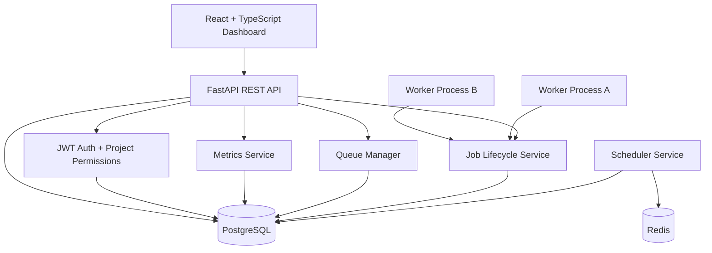
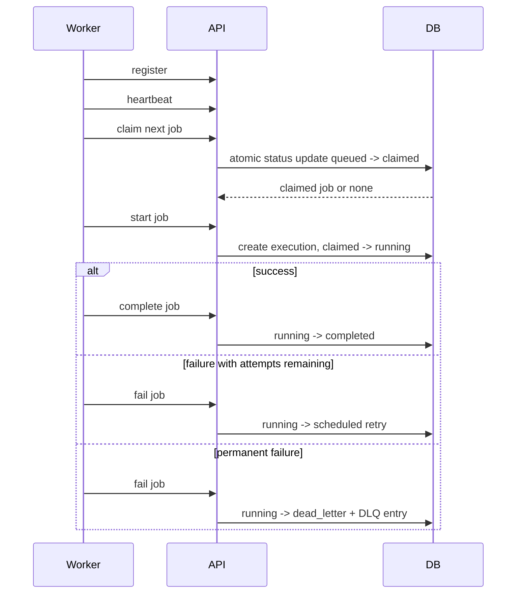

# Architecture

PulseQueue separates control-plane APIs from background execution. Users and operators interact through the React dashboard and REST API. Workers are independent processes that poll for work, claim jobs atomically, execute payload handlers, and report lifecycle transitions. A scheduler service handles delayed jobs and stale-worker recovery.

## Runtime Services

- `api`: FastAPI app exposing `/api/v1`.
- `scheduler`: Promotes due scheduled jobs, marks stale workers offline, and requeues stale claimed/running jobs.
- `worker`: Registers itself, sends heartbeats, claims jobs, executes jobs concurrently, and reports success/failure.
- `postgres`: Primary relational store.
- `redis`: Reserved for cache/rate limiting/distributed locking extensions.
- `frontend`: React dashboard.

## Reliability Flow

## Atomic Claiming

The `claim_next_job` service scans eligible jobs by priority and scheduled time, filters out paused queues, checks queue concurrency, and performs a guarded status update. PostgreSQL can use row locks with `SKIP LOCKED`; SQLite tests use a guarded update to prove only one caller transitions a queued job to claimed.

