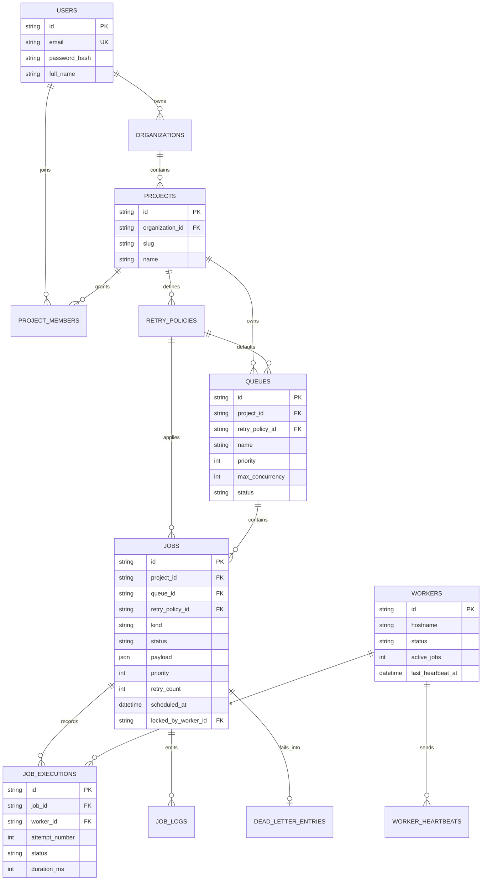

# ER Diagram

```mermaid
erDiagram
    USERS ||--o{ ORGANIZATIONS : owns
    ORGANIZATIONS ||--o{ PROJECTS : contains
    USERS ||--o{ PROJECT_MEMBERS : joins
    PROJECTS ||--o{ PROJECT_MEMBERS : grants
    PROJECTS ||--o{ QUEUES : owns
    PROJECTS ||--o{ RETRY_POLICIES : defines
    RETRY_POLICIES ||--o{ QUEUES : defaults
    RETRY_POLICIES ||--o{ JOBS : applies
    QUEUES ||--o{ JOBS : contains
    JOBS ||--o{ JOB_EXECUTIONS : records
    JOBS ||--o{ JOB_LOGS : emits
    JOBS ||--o| DEAD_LETTER_ENTRIES : fails_into
    WORKERS ||--o{ JOB_EXECUTIONS : runs
    WORKERS ||--o{ WORKER_HEARTBEATS : sends

    USERS {
        string id PK
        string email UK
        string password_hash
        string full_name
    }

    PROJECTS {
        string id PK
        string organization_id FK
        string slug
        string name
    }

    QUEUES {
        string id PK
        string project_id FK
        string retry_policy_id FK
        string name
        int priority
        int max_concurrency
        string status
    }

    JOBS {
        string id PK
        string project_id FK
        string queue_id FK
        string retry_policy_id FK
        string kind
        string status
        json payload
        int priority
        int retry_count
        datetime scheduled_at
        string locked_by_worker_id FK
    }

    JOB_EXECUTIONS {
        string id PK
        string job_id FK
        string worker_id FK
        int attempt_number
        string status
        int duration_ms
    }

    WORKERS {
        string id PK
        string hostname
        string status
        int active_jobs
        datetime last_heartbeat_at
    }
```

